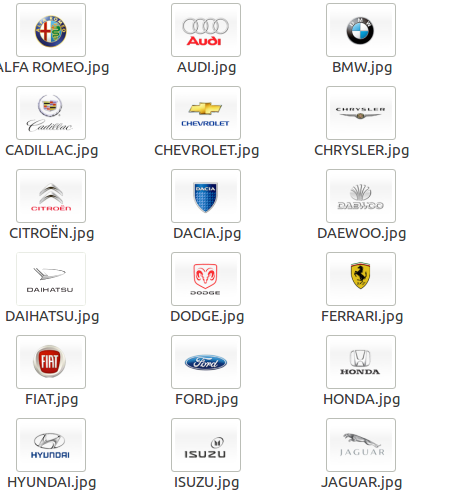
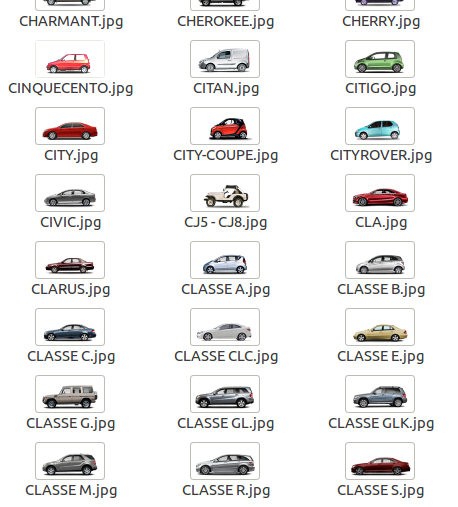

# Car-Info-Scraper

Car-Info-Scraper uses Python Selenuim & BeautilfulSoup modules to retrieve information about cars brands and associated model with their images, all of which organize in specific folders.

In order to use this project it is necessary to follow the following steps:

1-Install Python version  2.7.11 (or 3.4) [Here](https://www.python.org/downloads/)

2-Download Selenuim Chrome Driver [Here](https://sites.google.com/a/chromium.org/chromedriver/downloads)

3-Edit "selenuim.py" file (line 47) to specify the path to the chrome driver.

4- Use in commande line :  python <File_Name> .py

  -marqueImgLinkScrapper.py (Retrieves information about the brands, models and download images for all of them).

  -pieceScrapper.py (Retrieve car pieces list and sort it by category).

  -selenuim.py (Retrieves information about Vehicle (Brand, model and type).
  
  Here is an Output Examples : 
  
## List Of Brands : 
  
  
  
##List Of Models : 
  
  
